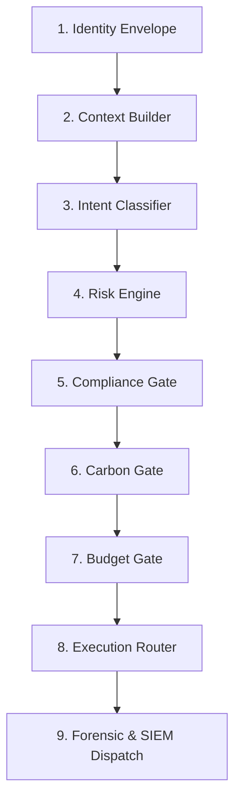

AgentShield opera mediante un **Decision Graph** unificado que garantiza que cada token generado esté gobernado por identidad, riesgo, política y economía.

## Las Etapas del Ciclo de Vida

### 1. Identity Envelope (JWT/SSO)
- **Función**: Verifica la autenticidad del emisor y resuelve el `tenant` mediante el dominio.
- **Implementación**: `verify_identity_envelope` in `identity.py`.

### 2. Context Builder
- **Función**: Crea el `DecisionContext` inmutable ("Passport") que acumula el rastro de auditoría.

### 3. Intent Classifier
- **Función**: Clasifica la intención semográfica para detectar desviaciones de uso.

### 4. Risk Engine (Trust Score)
- **Función**: Evalúa la reputación del usuario y aplica Tiering de modelos (Premium vs Standard).

### 5. Compliance Gate (PII & Redaction)
- **Función**: Escaneo y redacción de PII. Si es crítica, dispara un **Event Bus Alert** y bloquea la petición.
- **SIEM Trigger**: `event_bus.publish("PII_BLOCKED", "CRITICAL")`.

### 6. Carbon Gate (Green Routing)
- **Función**: Desvía intenciones triviales a modelos Eco-Friendly para ahorrar gCO2.
- **Implementación**: `carbon_governor.check_budget_and_route`.

### 7. Budget Gate
- **Función**: Verifica límites de gasto en tiempo real. 
- **SIEM Trigger**: `event_bus.publish("BUDGET_EXCEEDED", "WARNING")`.

### 8. Execution Router
- **Función**: Arbitraje multimodelo resiliente.

### 9. Forensic & SIEM Dispatch
- **Función**: Firma el recibo forense, liquida costes (Gross vs Net) e informa al Sistema Inmunológico.
- **Implementación**: `receipt_manager.py` y `invoice_service.py`.

## The Decision Context Passport 🛂
Cada petición genera un `DecisionContext` inmutable que actúa como un pasaporte, acumulando logs de cada Gate:
1. `trace_id`: Identificador único universal.
2. `trust_score`: Instantánea de reputación al inicio.
3. `intent`: Clasificación semántica del usuario.
4. `green_routing_active`: Flag si se optimizó por clima.
5. `decision_log`: Rastro de qué Gate tomó qué decisión.

---
**AgentShield OS: Control Total sobre el Caos de la IA.**
