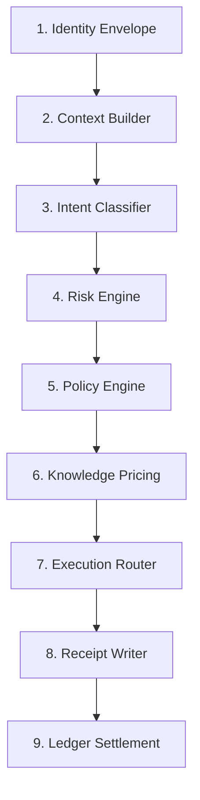

# 13. Decision Graph: AgentShield Core Engine 🧠

AgentShield opera mediante un **Decision Graph** de 9 etapas que garantiza que cada token generado esté gobernado por identidad, riesgo, política y economía.

## Las 9 Estapas del Ciclo de Vida

### 1. Identity Envelope (JWT/SSO)
- **Función**: Verifica la autenticidad del emisor usando firmas RSA.
- **Implementación**: `verify_identity_envelope` in `identity.py`.

### 2. Context Builder
- **Función**: Reúne metadatos del `tenant`, `user`, `dept` y `cost_center`.
- **Implementación**: Clase `AgentShieldContext` en `schema.py`.

### 3. Intent Classifier (Semantic Budgeting)
- **Función**: Clasifica la intención (ej: `LEGAL`, `CODING`) para detectar desviaciones de rol.
- **Implementación**: `semantic_router.classify_intent` in `semantic_router.py`.

### 4. Risk Engine (Trust Score)
- **Función**: El "Corazón Moral". Evalúa el `Trust Score` (0-100) en Redis.
- **Lógica**: 
    - Si el score es `< 70`, el sistema aplica un `Downgrade` silencioso a modelos más baratos/seguros.
    - Si el score es `< 30`, el sistema activa el modo `Supervised` bloqueando la respuesta.
- **Implementación**: `trust_system.py`.

### 5. Policy Engine
- **Función**: Barrera binaria (BLOCK/ALLOW) y sanitización PII dinámica.
- **Feedback Loop**: Cada violación detectada por el Policy Engine dispara un castigo de `-5` a `-10` puntos en el Risk Engine.
- **Implementación**: `evaluate_policies` in `policy_engine.py`.

### 6. Knowledge Pricing (Internal Economy)
- **Función**: Si se usa RAG, verifica licencias y cobra micro-pagos internos entre departamentos.
- **Liquidación**: Los pagos se registran en el `internal_ledger`.
- **Implementación**: `marketplace.py`.

### 7. Carbon Gate (Green Routing)
- **Función**: Desvía la petición a modelos eco-eficientes si la intención es trivial (ej: saludos).
- **Implementación**: `carbon_governor.check_budget_and_route`.

### 8. Execution Router
- **Función**: Arbitraje multimodelo con resiliencia y circuit breaking.
- **Implementación**: `execute_with_resilience` in `llm_gateway.py`.

### 9. Forensic Audit & Settlement
- **Función**: Firma el recibo forense con el `DecisionContext` completo y liquida costos.
- **Implementación**: `receipt_manager.py` y `limiter.py`.

## The Decision Context Passport 🛂
Cada petición genera un `DecisionContext` inmutable que actúa como un pasaporte, acumulando logs de cada Gate:
1. `trace_id`: Identificador único universal.
2. `trust_score`: Instantánea de reputación al inicio.
3. `intent`: Clasificación semántica del usuario.
4. `green_routing_active`: Flag si se optimizó por clima.
5. `decision_log`: Rastro de qué Gate tomó qué decisión.

---
**AgentShield OS: Control Total sobre el Caos de la IA.**
