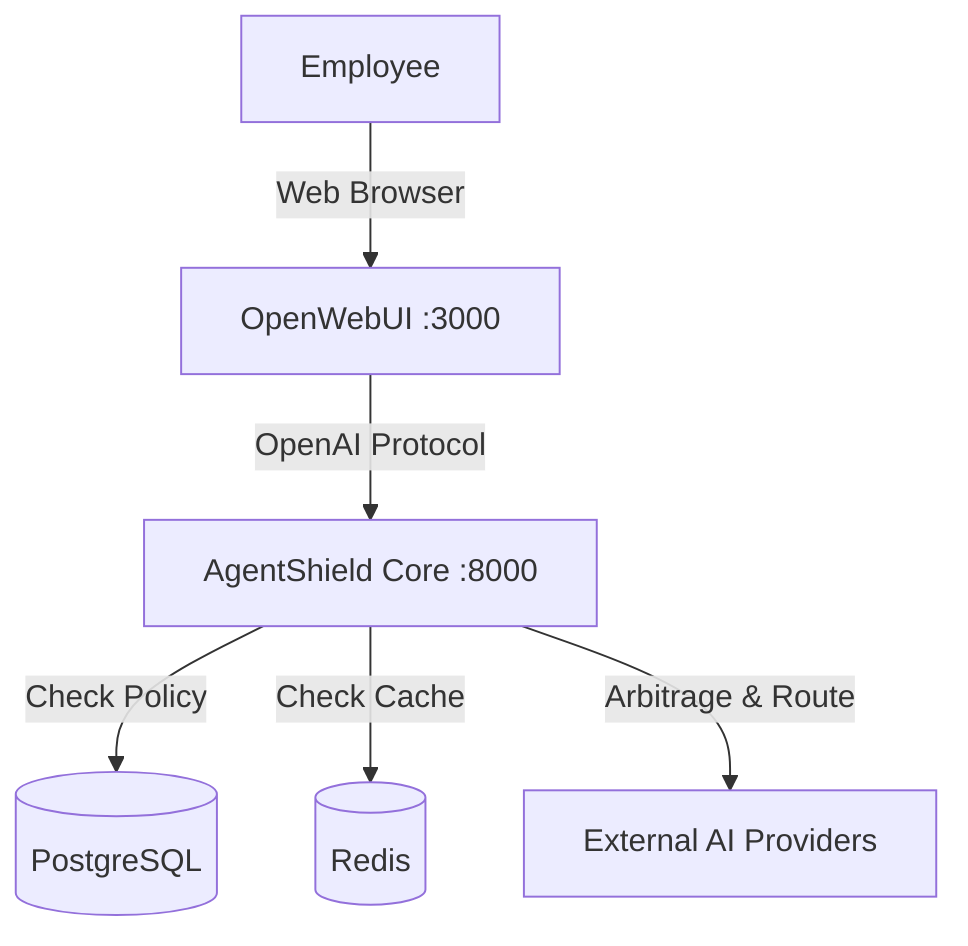

# AgentShield Appliance Deployment Guide

This guide describes how to deploy AgentShield as a self-contained "AI Operating System" using Docker Compose. This configuration bundles the Frontend (OpenWebUI), Backend (AgentShield Core), and Databases (Redis/Postgres).

## Architecture



## Quick Start

1.  **Configure Environment**:
    Ensure you have your OpenAI/Provider keys ready.

2.  **Deploy**:
    ```bash
    docker-compose up -d
    ```

3.  **Access**:
    - **User Interface**: `http://localhost:3000`
    - **Admin Dashboard**: `http://localhost:3000/admin`

## Flight Modes (Model Selection)

Users can select these "Models" in the dropdown. AgentShield intercepts them and applies logic:

-   **`agentshield-fast`** (Recommended):
    -   **Behavior:** Aggressive Financial Arbitrage.
    -   **Logic:** Analyzes prompt complexity. Simple queries go to cheap models (Llama-3, Haiku). Complex queries go to stronger models.
    -   **Goal:** Maximum Cost Savings (up to 98%).

-   **`agentshield-smart`** (Executive/Legal):
    -   **Behavior:** Direct routing to SOTA models (GPT-4o).
    -   **Logic:** Bypasses arbitrage engine.
    -   **Goal:** Maximum Intelligence & Determinism.

## Zero-Trust Security

By default, the Appliance enforces:
-   **PII Scrubbing:** Redacts emails, phones, and credit cards locally.
-   **Entropy Detection:** Blocks high-entropy strings (potentially leaked API keys).
-   **Custom Rules:** Applies tenant-specific blocklists defined in the database.
