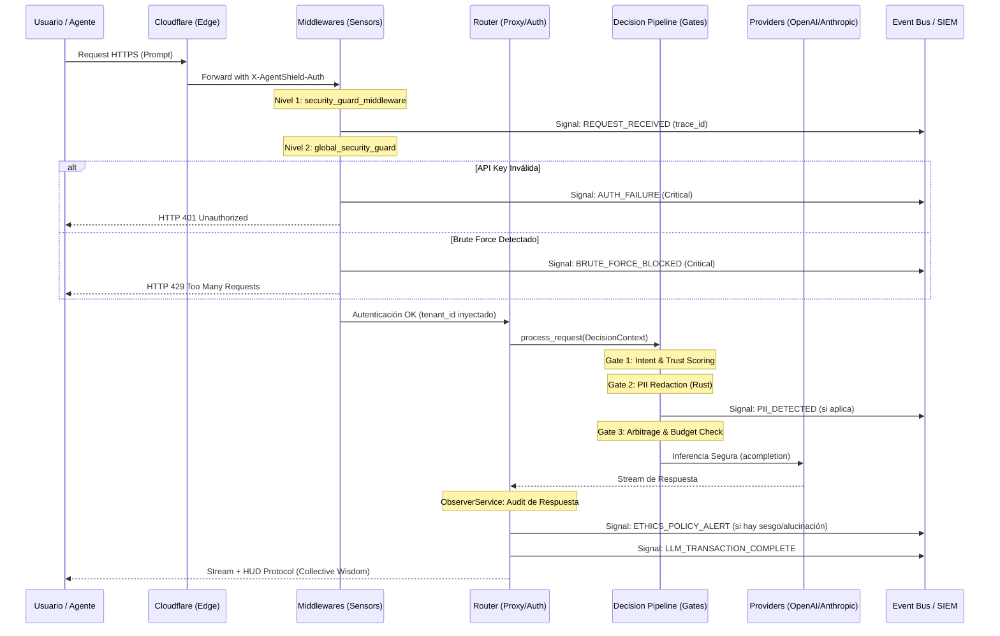

# 🚀 El Viaje del Request 2026: Arquitectura de Conexión Total

Este documento describe la secuencia exacta de eventos desde que un usuario o agente lanza un prompt hasta que recibe el "HUD Protocol" con la respuesta blindada. Es el diagrama maestro para entender el **Absolute Zenith** de AgentShield.

---

## ⚡ Diagrama de Secuencia Maestro (Mermaid)

---

## 💎 Los 3 Momentos de la Verdad

### 1. El Momento de la Defensa (Middleware)
Antes de que AgentShield gaste 1ms de CPU en IA, los middlewares actúan como **sensores sísmicos**. 
*   **Valor:** La empresa sabe que está siendo atacada o escaneada **antes** de que el ataque tenga éxito, gracias a las señales enviadas al SIEM en este nivel.

### 2. El Momento de la Decisión (Pipeline)
Aquí es donde ocurre la magia técnica. El `DecisionContext` es la "Caja Negra" que registra por qué se eligió un modelo u otro, qué datos se redactaron y qué riesgo se asumió.
*   **Valor:** Trazabilidad absoluta. Cada `trace_id` permite reconstruir por qué una respuesta costó $0.002 en lugar de $0.02.

### 3. El Momento de la Verdad (Observer & HUD)
La respuesta no se entrega a ciegas. El `ObserverService` audita la IA mientras el usuario lee. 
*   **Valor:** El HUD Protocol no es solo estética; es **transparencia radical**. El usuario ve el score de veracidad y el ahorro en tiempo real, reforzando el valor de la plataforma con cada palabra.

---

## 📈 Conclusión
Esta arquitectura de **"Señalización Continua"** convierte a AgentShield en un sistema que no solo protege, sino que **aprende y comunica**. En 2026, la seguridad es visibilidad, y este flujo de vida garantiza que la empresa siempre tenga el control total del viaje de sus datos.
