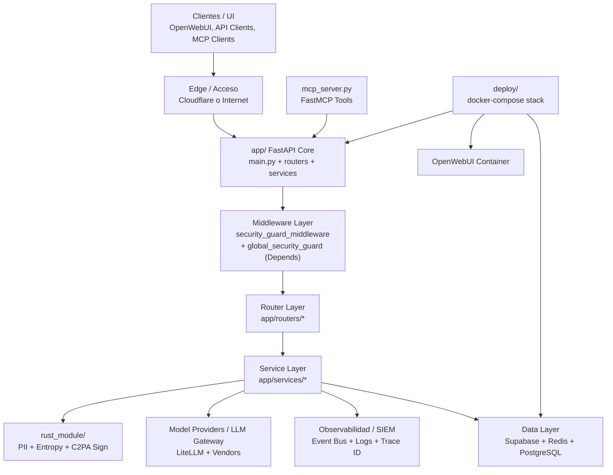

 # 🌐 Esquema Global del Proyecto (app + deploy + rust_module + mcp_server)
 
 Este documento resume la arquitectura completa con un diagrama Mermaid **seguro** y una explicacion precisa para un programador senior.
 
 ---
 
## ✅ Diagrama Mermaid (Seguro, sin errores)
 

 
 ---
 
 ## 🧠 Explicacion por capas (senior overview)
 
### 1) Clientes / UI
 - **OpenWebUI** (modo UI para humanos).
 - **API Clients** (SDKs, apps internas, agentes).
 - **MCP Clients** (Claude, Cursor) via `mcp_server.py`.

**Como se conectan:**
- OpenWebUI habla con `/v1` como si fuera OpenAI.
- MCP usa tools que llaman Supabase o servicios internos.
- Clientes API usan API Keys o JWT.
 
 ---
 
### 2) Edge / Acceso
 - Puede pasar por **Cloudflare** (si se configura el secreto).
 - Controla el acceso directo a la IP del backend.

**Resultado:** solo trafico con `X-AgentShield-Auth` valido entra cuando el secreto esta activo.
 
 ---
 
### 3) app/ (FastAPI Core)
 Es el cerebro del sistema:
 - **main.py**: arranque, warmup, health, registro de routers.
 - **Middleware**: seguridad + auth.
 - **Routers**: capa HTTP, definicion de endpoints.
 - **Services**: logica de negocio real.
 
 **Flujo interno (simplificado):**  
 `Request -> Middlewares -> Routers -> Services -> DB/LLM/Observabilidad`

**Detalles reales de arranque (main.py):**
- Tareas async: `recover_pending_charges`, `init_semantic_cache_index`, `update_market_rules`, `sync_universal_prices`.
- Warmup: `pii_guard.redact_pii_sync` y `reranker.get_reranker_model`.
- Health: `/health` con modo `full` que valida Redis + Supabase.
- Exception handler global: retorna JSON con `trace_id`.

**Readiness real:**
- `MODELS_LOADED` controla si el health responde `warming_up`.
- Si `full=true` y Redis/Supabase fallan, retorna `503`.
 
 ---
 
### 4) Middleware Layer
- `security.py`: proteccion Cloudflare + headers + `trace_id` y latencia.
- `auth.py` (via `Depends` global): auth + brute force + inyeccion de `tenant_id`.

**Orden efectivo:**
1. `global_security_guard` se ejecuta como dependencia global de FastAPI.
2. `security_guard_middleware` corre como middleware HTTP en cada request.
 
**Impacto:** nada entra a routers sin pasar por este control.

**Efecto de orden:** la seguridad de auth corre antes de llegar a routers, y el middleware de headers/Cloudflare corta accesos directos.
 
 ---
 
### 5) Router Layer (`app/routers/*`)
 Define **todas las rutas HTTP**:
 - Proxy principal `/v1/chat/completions`
 - Autorizacion, receipts, compliance, analytics, dashboard, etc.
 
 Cada router delega en servicios especializados.

**Routers montados en `main.py`:**
`public_config`, `authorize`, `receipt`, `dashboard`, `proxy`, `onboarding`, `compliance`,
`invoices`, `analytics`, `audit`, `embeddings`, `feedback`, `admin_chat`, `tools`,
`images`, `forensics`, `trust`, `admin_roles`, `webhooks`.

**Grupos funcionales:**
- **Ejecucion IA:** `proxy`, `images`, `embeddings`
- **Finanzas:** `authorize`, `receipt`, `invoices`, `budget_management`
- **Cumplimiento:** `compliance`, `audit`, `forensics`, `ai_act_compliance`
- **Admin:** `dashboard`, `admin_roles`, `admin_chat`, `tools`
- **Confianza y feedback:** `trust`, `feedback`
- **Config publica:** `public_config`, `pii_config`
 
 ---
 
### 6) Service Layer (`app/services/*`)
 Es la capa de orquestacion y logica real:
 - **DecisionPipeline**: gates de seguridad, confianza, PII, budget.
 - **Billing**: recibos, WAL, contabilidad.
 - **Trust / Policy / Tool Governor**: seguridad y gobernanza.
 - **Hive Mind / RAG**: memoria corporativa.
 - **LLM Gateway**: acceso unificado a proveedores.
 - **Market Pricing**: `services/market_pricing.py`.
 - **Budget Limiter**: `services/budget_limiter.py`.

**Nota:** aqui se consumen Redis/Supabase y se generan recibos forenses.

**Flujo critico (proxy):**
1) Construye `DecisionContext`
2) Gate de intent + trust + PII
3) Arbitrage y budget
4) LLM Gateway
5) Receipt + billing + eventos
 
 ---
 
### 7) Data Layer (Supabase + Redis + PostgreSQL)
 - **Redis**: hot path (spend tracking, rate limit, cache).
 - **Supabase**: persistencia real + RPCs.
 - **Postgres local** en docker-compose para entorno local.

**WAL financiero:**
- Redis guarda WAL de gastos.
- Worker asinc recupera y persiste en Supabase.
 
 ---
 
### 8) rust_module/
 Capa de rendimiento critico (Rust + PyO3):
 - `scan_pii_fast`: PII regex ultra rapido.
 - `scrub_pii_fast`: redaccion directa.
 - `scan_entropy_fast`: secretos por entropia.
 - `sign_c2pa_image_fast`: firma C2PA de imagenes.
 
**Impacto:** acelera PII Guard y signing sin bloquear Python.
Se invoca desde `app/services/pii_guard.py` y otros servicios sensibles.

**Garantias:**
- O(n) en escaneo regex precompilado.
- Redaccion deterministica en Rust.
 
 ---
 
### 9) mcp_server.py
 Servidor de herramientas MCP externas:
 - Trust profile
 - Vault search
 - Wallet balance
 - Politicas dinamicas
 - Timeline forense
 
**Impacto:** integra agentes externos con el core sin exponer APIs internas directas.
Usa Supabase directo para lectura/escritura controlada.

**Nota:** varias tools son "demo-first" (fallbacks y resoluciones simplificadas).
 
 ---
 
### 10) deploy/
 Define la **orquestacion local**:
 - Core FastAPI (agentshield)
 - OpenWebUI
 - Redis
 - Postgres
 
 Permite testing local y stack completo.

**Detalle de OpenWebUI:**
- Usa `OPENAI_API_BASE_URL` apuntando a AgentShield.
- Habilita `WEBUI_AUTH` y configuraciones de modelo.

**Red interna:** `internal_brain_net` aisla servicios locales.

---

## ✅ Dependencias criticas (resumen)
- **Seguridad:** `security.py` + `auth.py` antes de routers.
- **Gasto:** `increment_spend` con WAL en Redis + persistencia Supabase.
- **Observabilidad:** `event_bus` y `trace_id` en todas las rutas.
- **PII:** `pii_guard` depende de `rust_module`.
- **MCP:** tools leen/escriben en Supabase.
 - **Rate limiting HTTP:** `http_limiter.py`.
 - **Estimacion multimodal:** `cost_estimator.py`.

---

## ✅ Flujo macro del sistema (1 request)
1) Request llega (posible Cloudflare)
2) `global_security_guard` valida auth y tenant
3) `security_guard_middleware` valida acceso y headers
4) Router decide caso de uso (proxy/receipt/etc)
5) Service ejecuta logica real (pipeline, billing, compliance)
6) Persistencia en Redis/Supabase + eventos SIEM
7) Respuesta con `trace_id`
 
